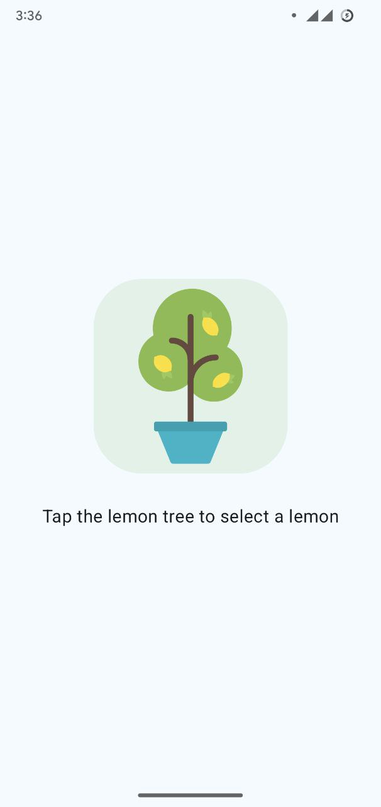

# Lemonade Maker App 🍋

This project is from Unit 2 of the "Android Basics with Compose" course. It's an interactive, multi-step app that simulates the process of making lemonade. The user taps the screen to advance from picking a lemon, to squeezing it, to drinking the lemonade.

## Project Overview

This app was built to practice more complex state management. The UI (image and text) changes based on the user's progress through the lemonade-making steps. It also includes logic for requiring a random number of "squeezes" before the lemon turns into lemonade.

## Screenshot

## Key Learnings

* Managing multiple state variables to track the current step and other data (like squeeze count).
* Updating UI elements dynamically based on state changes.
* Structuring code to handle a sequence of user actions.
* Reinforcing `remember` and `mutableStateOf` for state management.
